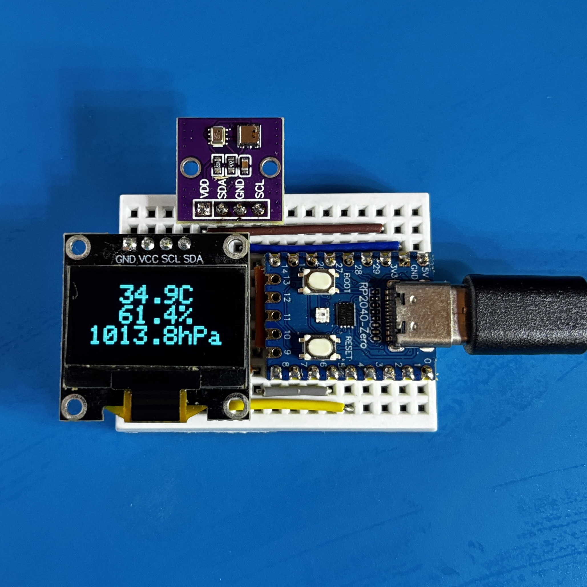
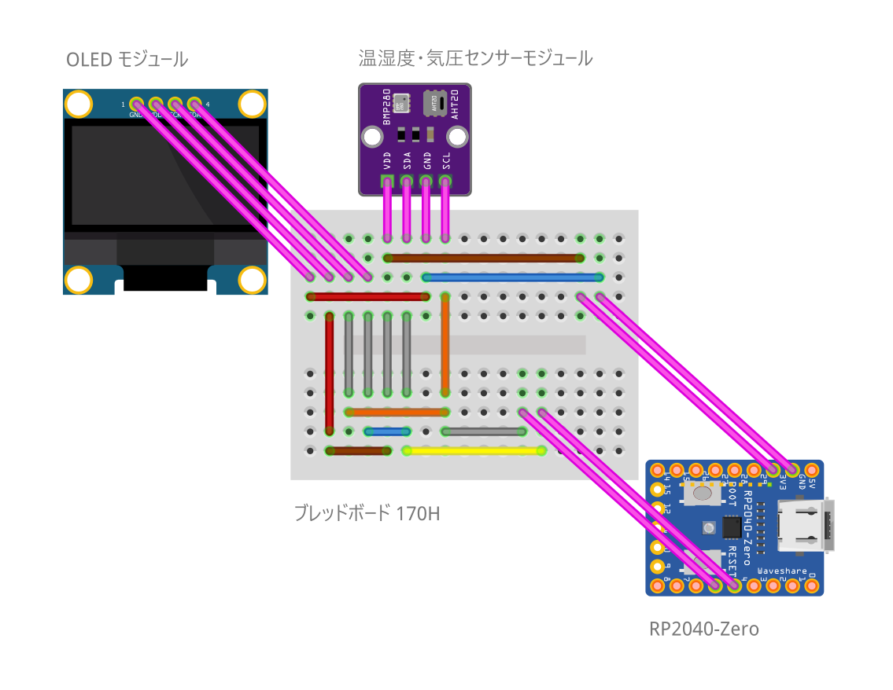

# Arduino: RP2040-Thermohygrometer-Deluxe

RP2040-Zero を使用したコンパクトな温湿度・気圧計のデラックス版です。

温湿度と気圧のグラフ表示と上下反転表示に対応しています。
３つの OLED を使用して、温度・湿度・気圧のグラフを同時に表示します。

## 部材

| 種別 | 型番など | 数量 |
|:-----|:---------|:-----|
| マイコン | RP2040-Zero | 1個 |
| OLED モジュール | 0.91" 128x32 SSD1306 | 3個 |
| 温湿度・気圧センサーモジュール | AHT20+BMP280 | 1個 |
| タクトスイッチ | 2P 6x6mm | 2個 |
| ブレッドボード | 400H | 1個 |
| ジャンパーワイヤ | - | 28本 |

## 接続

### OLED ディスプレイ #1

| OLED モジュール | RP2040-Zero  |
| --------------- | ------------ |
| VCC             | 3.3V         |
| GND             | GND          |
| SDA             | GPIO 29      |
| SCL             | GPIO 28      |

### OLED ディスプレイ #2

| OLED モジュール | RP2040-Zero  |
| --------------- | ------------ |
| VCC             | 3.3V         |
| GND             | GND          |
| SDA             | GPIO 4       |
| SCL             | GPIO 6       |

### OLED ディスプレイ #3

| OLED モジュール | RP2040-Zero  |
| --------------- | ------------ |
| VCC             | 3.3V         |
| GND             | GND          |
| SDA             | GPIO 7       |
| SCL             | GPIO 8       |

### タクトスイッチ

| タクトスイッチ | RP2040-Zero |
|:--------|:------------------|
| タクトスイッチ #1 PIN 1 | GPIO 0 |
| タクトスイッチ #1 PIN 2 | GPIO 2 |
| タクトスイッチ #2 PIN 1 | GPIO 3 |
| タクトスイッチ #2 PIN 2 | GPIO 5 |

### 温湿度・気圧センサーモジュール

| 温湿度・気圧センサーモジュール | RP2040-Zero  |
| ------------------------------ | ------------ |
| VCC                            | 3.3V         |
| SDA                            | GPIO 29      |
| GND                            | GND          |
| SCL                            | GPIO 28      |

## 配線図

## 開発環境

### 必須ソフトウェア

| ソフトウェア | 説明 |
|:-----------|:-----|
| Arduino IDE | 開発環境 |

### 依存ライブラリ

| ライブラリ | 説明 |
|:-----------|:-----|
| SoftI2C | I2Cバス制御 |
| Adafruit SSD1306 | OLEDディスプレイ制御（定数定義のみ使用） |

**インストール**: Arduino IDEのライブラリマネージャーで検索・インストール

## 操作

マイコンに電源を供給すると作動します。
定期的に温湿度・気圧を測定して、OLED に表示します。

下ボタンを押すと、表示パターンが切り替わります。

上ボタンを押すと、表示が上下反転します。

## ライセンス

このプロジェクトは [MIT ライセンス](./LICENSE) の下で公開されています。
自由に使用、改変、再配布していただけます。
