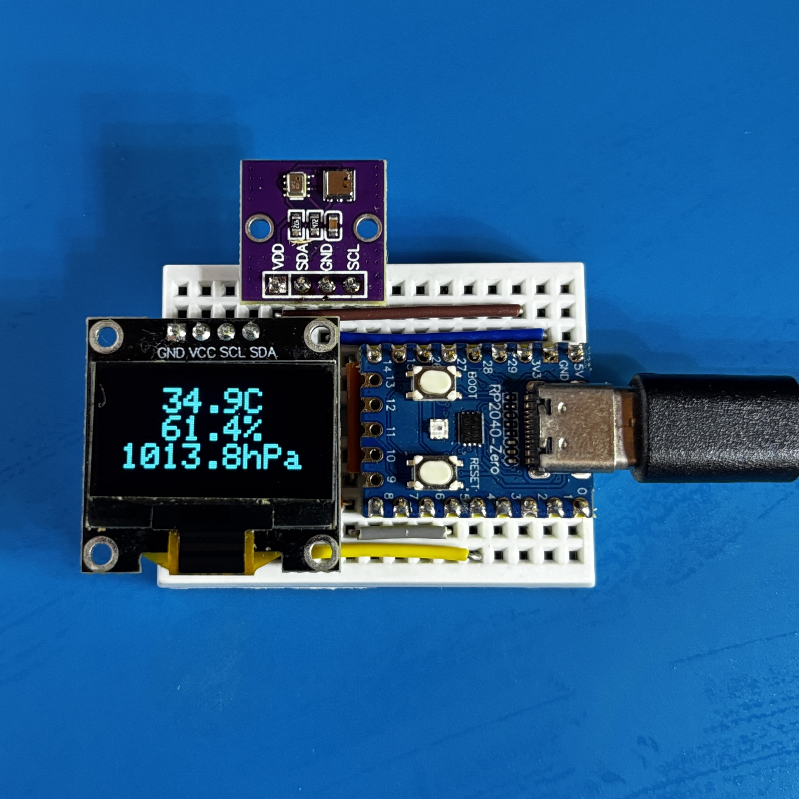

# Arduino: RP2040-Thermohygrometer-Deluxe

RP2040-Zero を使用した温湿度・気圧計です。

## 部材

- RP2040-Zero 1 個
- OLED モジュール（0.91" 128x32 SSD1306） 3 個
- 温湿度・気圧センサーモジュール（AHT20+BMP280） 1 個
- ブレッドボード 400H 1 個
- ジャンパーワイヤ 14 本

## 接続

### OLED ディスプレイ #1

| OLED モジュール | RP2040-Zero  |
| --------------- | ------------ |
| VCC             | 3.3V         |
| GND             | GND          |
| SDA             | GPIO 4 (SDA) |
| SCL             | GPIO 5 (SCL) |

### OLED ディスプレイ #2

| OLED モジュール | RP2040-Zero  |
| --------------- | ------------ |
| VCC             | 3.3V         |
| GND             | GND          |
| SDA             | GPIO 4 (SDA) |
| SCL             | GPIO 5 (SCL) |

### OLED ディスプレイ #3

| OLED モジュール | RP2040-Zero  |
| --------------- | ------------ |
| VCC             | 3.3V         |
| GND             | GND          |
| SDA             | GPIO 4 (SDA) |
| SCL             | GPIO 5 (SCL) |

### 温湿度・気圧センサーモジュール

| 温湿度・気圧センサーモジュール | RP2040-Zero  |
| ------------------------------ | ------------ |
| VCC                            | 3.3V         |
| SDA                            | GPIO 4 (SDA) |
| GND                            | GND          |
| SCL                            | GPIO 5 (SCL) |

## 配線図

## 開発環境

- IDE: Arduino IDE
- ライブラリ:
  - SoftI2C
  - Tiny4kOLED

## 操作

定期的に温湿度・気圧を測定して、OLED に表示します。

## ライセンス

このプロジェクトは [MIT ライセンス](./LICENSE) の下で公開されています。
自由に使用、改変、再配布していただけます。
