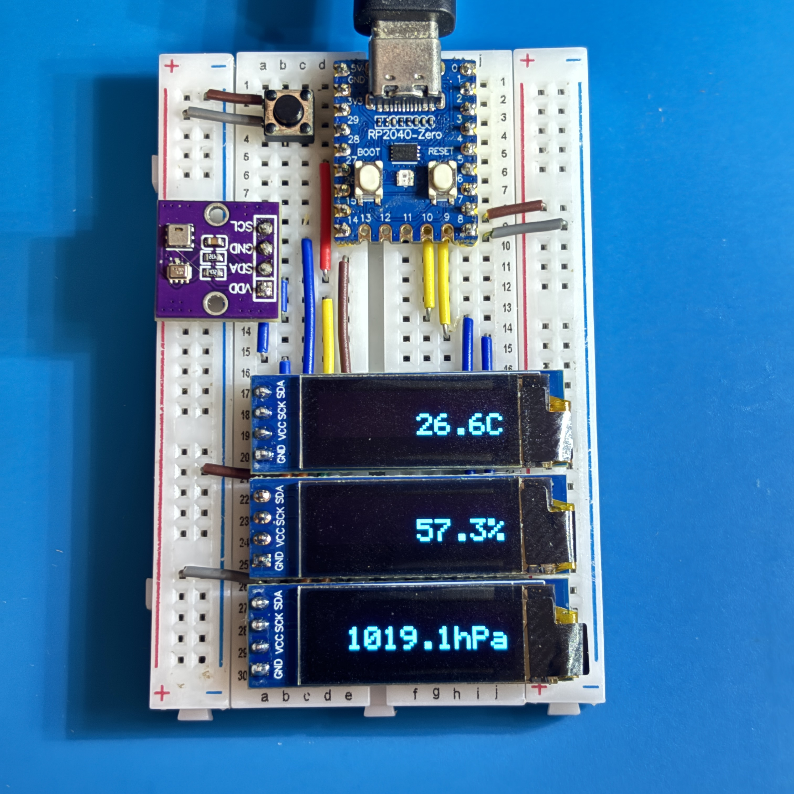

# Arduino: RP2040-Thermohygrometer-Deluxe

RP2040-Zero を使用したコンパクトな温湿度・気圧計のデラックス版です。

温湿度と気圧のグラフ表示と上下反転表示に対応しています。
３つの OLED を使用して、温度・湿度・気圧のグラフを同時に表示します。

## 部材

| 種別 | 型番など | 数量 |
|:-----|:---------|:-----|
| マイコン | RP2040-Zero | 1個 |
| ブレッドボード | 400H | 1個 |
| ジャンパーワイヤ | - | 29本 |
| タクトスイッチ | 2P 6x6mm | 1個 |
| OLED モジュール | 0.91" 128x32 SSD1306 | 3個 |
| 温湿度・気圧センサーモジュール | AHT20+BMP280 | 1個 |

## 配線図

## プログラム開発環境

### 統合開発環境

| 名前 | 説明 |
|:-----------|:-----|
| Arduino IDE | 統合開発環境 |

**インストール**: 公式サイト [https://www.arduino.cc/en/software/#ide](https://www.arduino.cc/en/software/#ide) からダウンロード・インストール

### ボードサポートパッケージ

| 名前 | 説明 |
|:------|:-----|
| Raspberry Pi Pico/RP2040/RP2350 | ボードサポートパッケージ |

**インストール**: Arduino IDE のボードマネージャーで検索・インストール

### 依存ライブラリ

| ライブラリ | 説明 |
|:-----------|:-----|
| SoftI2C | I2Cバス制御 |
| Adafruit SSD1306 | OLEDディスプレイ制御（定数定義のみ使用） |

**インストール**: Arduino IDEのライブラリマネージャーで検索・インストール

## 操作

マイコンに電源を供給すると作動します。
定期的に温湿度・気圧を測定して、OLED に表示します。

ボタンを押すと、表示パターンが切り替わります。

ボタンを長押しすると、上下反転表示します。

## ライセンス

このプロジェクトは [MIT ライセンス](./LICENSE) の下で公開されています。
自由に使用、改変、再配布していただけます。
